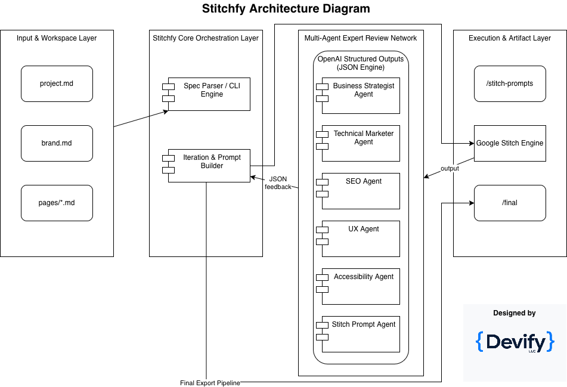
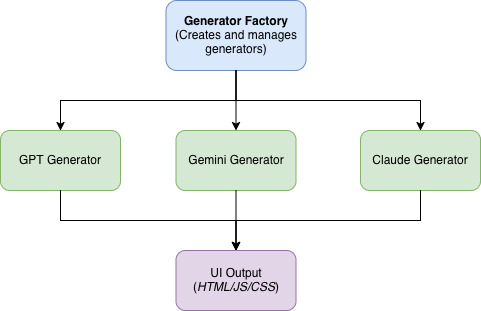

# Stitchfy

> A repeatable, structured, and auditable framework for transforming business specifications into polished websites using AI-powered design pipelines.

## 🚀 Getting Started (3 Steps)

```bash
# 1. Install dependencies
pip3 install -r requirements.txt

# 2. Set up your API keys (choose at least one provider)
cp .env.example .env
# Edit .env and add: OPENAI_API_KEY, ANTHROPIC_API_KEY, or GOOGLE_API_KEY

# 3. Generate your first website page
python3 -m src.cli.commands generate --page home --generator gpt --show-cost
```

**Choose Your AI Provider:**
- `--generator gpt` → OpenAI GPT-4 (balanced, reliable)
- `--generator claude` → Anthropic Claude (advanced reasoning)
- `--generator gemini` → Google Gemini (fast, often free)

📖 **Full Setup Guide:** See [SETUP.md](SETUP.md) | **Detailed Usage:** See [MULTI_GENERATOR_GUIDE.md](MULTI_GENERATOR_GUIDE.md)

---

## Overview

**Stitchfy** is an advanced, deterministic orchestration framework that bridges the gap between raw business requirements and high-fidelity, AI-driven UI development. By implementing a systematic multi-agent architecture, Stitchfy automates the optimization, review, and refinement loops required to generate production-ready websites.

The framework orchestrates multiple specialized AI agents to autonomously evaluate designs through critical industry lenses—including technical marketing, User Experience (UX), Search Engine Optimization (SEO), Web Accessibility (WCAG compliance), and core implementation logic.

### System Architecture

The following schematic outlines the execution architecture of the Stitchfy framework, detailing the data lifecycle from initial plain-text specifications to final production delivery via our multi-agent refinement loops:



### Why Stitchfy?

- **Accessible**: Write specs in plain English Markdown—no technical expertise required
- **Structured**: Organized agent pipeline ensures comprehensive coverage
- **Auditable**: Track every transformation from spec to final design
- **Iterative**: Built-in review and refinement cycles
- **AI-Native**: Leverages multiple AI providers (GPT, Claude, Gemini) for flexible, high-quality UI generation
- **Multi-Provider**: Choose from OpenAI GPT-4, Anthropic Claude, or Google Gemini based on your needs and preferences

---

## Core Concept

Stitchfy provides a **multi-strategy generator system** that allows you to choose from multiple AI providers for UI generation. The framework acts as an intelligent orchestration layer that:

1. Parses your business requirements
2. Generates optimized prompts for your chosen AI provider
3. Reviews generated designs with specialized agents
4. Refines prompts based on expert feedback
5. Produces production-ready HTML, CSS, and JavaScript

### Supported AI Providers

- **OpenAI GPT-4** - Industry-leading language model with excellent code generation
- **Anthropic Claude** - Advanced reasoning and long-context capabilities
- **Google Gemini** - Fast, efficient, with multimodal capabilities
- **Fallback Support** - Automatically switch to alternative providers if primary fails

---

## Quick Start

### 1. Clone and Install

```bash
# Clone the repository
git clone https://github.com/devifyllc/stitchfy.git
cd stitchfy

# Install dependencies
pip3 install -r requirements.txt
```

### 2. Define Your Specifications

Write your requirements in plain English:

```markdown
# Website Goal
Create a professional website for a cloud consulting company targeting U.S. SMBs.

# Audience
Non-technical business owners looking for reliable technology partners.

# Pages
- Home
- Services
- About
- Contact

# Tone
Modern, premium, practical, trustworthy.

# Conversion Goal
Book a discovery call.
```

### 3. Configure API Keys

Set up your environment variables:

```bash
# Copy the example environment file
cp .env.example .env

# Edit .env and add your API keys
# You only need keys for the providers you plan to use
```

### 4. Generate UI

```bash
# Generate using default generator (from config)
python3 -m src.cli.commands generate

# Generate using specific generator
python3 -m src.cli.commands generate --generator gpt
python3 -m src.cli.commands generate --generator claude
python3 -m src.cli.commands generate --generator gemini

# Generate with cost estimation
python3 -m src.cli.commands generate --show-cost

# Generate with automatic fallback
python3 -m src.cli.commands generate --with-fallback

# List available generators
python3 -m src.cli.commands list-generators

# Get info about a specific generator
python3 -m src.cli.commands info gpt
```

---

## Architecture

```
Markdown Specs
     ↓
Spec Parser
     ↓
AI Agent Pipeline
     ↓
Prompt Optimizer
     ↓
Multi-Strategy Generator
  ├── OpenAI GPT-4
  ├── Anthropic Claude
  └── Google Gemini
     ↓
HTML/CSS/JavaScript Output
     ↓
Reviewer Agents
     ↓
Refined Prompt / Code Recommendations
     ↓
Final Website Implementation
```

### Generator Strategy Pattern

Stitchfy uses a pluggable generator architecture:



---

## AI Agent Roles

Stitchfy orchestrates specialized AI agents, each focused on a specific domain:

### 🎯 Business Strategist Agent
- Clarifies positioning and value proposition
- Defines target audience characteristics
- Optimizes conversion goals and CTAs
- Ensures business objectives are met

### 📢 Technical Marketer Agent
- Improves copy and messaging
- Strengthens value propositions
- Adds trust signals and credibility markers
- Optimizes conversion language

### 🔍 SEO Agent
- Generates title tags and meta descriptions
- Optimizes heading hierarchy
- Identifies keyword opportunities
- Ensures semantic HTML structure
- Improves discoverability

### 🎨 UX Agent
- Optimizes layout and navigation
- Improves visual hierarchy
- Enhances conversion flows
- Ensures intuitive user journeys
- Reviews mobile responsiveness

### ♿ Accessibility Agent
- Validates WCAG compliance
- Checks color contrast ratios
- Ensures semantic structure
- Reviews keyboard navigation
- Validates form usability

### 🤖 Stitch Prompt Agent
- Converts all inputs into precise Google Stitch prompts
- Structures prompts for optimal output
- Incorporates feedback from all agents
- Maintains consistency across iterations

---

## Intelligent Prompt Generation

Stitchfy doesn't just pass raw user text to Google Stitch. It generates **structured, optimized prompts** like:

```
Create a responsive 4-page website for a technology consulting company.

Brand:
- Deep navy background (#0A192F)
- Bright blue accents (#007BFF)
- White/light sections (#F8FAFC)
- Modern enterprise style

Audience:
- U.S. small business owners
- Non-technical decision makers
- Seeking reliable technology partners

Pages:
1. Home
2. Services
3. About
4. Contact

Homepage sections:
- Hero with strong CTA ("Book a Discovery Call")
- Pain points section
- Services overview with cards
- Founder credibility section
- Final contact CTA

Style:
Premium, minimal, corporate, trustworthy.

Technical Requirements:
- Mobile-first responsive design
- Fast loading performance
- Semantic HTML structure
- WCAG AA accessibility compliance
```

---

## Current Generation Flow (v1.0.0)

Stitchfy v1.0.0 provides **direct UI generation** from specifications:

```
User Specifications (Markdown)
         ↓
   Configuration Loader
         ↓
   Generator Selection
   (GPT / Claude / Gemini)
         ↓
   AI Model Generation
         ↓
  HTML + CSS + JavaScript
         ↓
   Output Files Saved
```

**What's Generated:**
- Complete HTML with semantic structure
- Responsive CSS with modern layouts
- JavaScript for interactivity (when needed)
- Metadata with generation details

### Future: Iterative Refinement Loop (v2.0.0 - Planned)

The next major release will add **automated review and refinement**:

```
User Spec
    ↓
Generate UI (v1)
    ↓
Review Agents (parallel)
  ├── SEO Agent
  ├── UX Agent
  ├── Accessibility Agent
  └── Marketing Agent
    ↓
Structured Feedback (JSON)
    ↓
Refine Prompt
    ↓
Generate UI (v2)
    ↓
Final Polished Output
```

**Planned Review Features:**
- Automated SEO analysis and optimization
- UX/UI best practices validation
- WCAG accessibility compliance checking
- Marketing copy and CTA optimization
- Structured JSON feedback for refinements

---

## 💼 Stitchfy Pro & Commercial Ecosystem

Stitchfy Core is open-source and free to the community. For organizations requiring advanced enterprise capabilities, Devify LLC offers **Stitchfy Pro**, a proprietary extended framework that includes:

- **Proprietary Agent Tuning:** Custom-trained agents tailored to specific corporate brand compliance standards.
- **Enterprise Pipelines:** Advanced multi-threaded processing for large-scale corporate web architectures.
- **Direct Code Export:** Deep integrations with corporate CI/CD pipelines and cloud infrastructure deployment.
- **Secure Data Handling:** Zero-data retention agent endpoints ensuring enterprise-grade data privacy.

For inquiries regarding enterprise licensing, custom agent development, or commercial consulting, contact us at [cardozo@devifyllc.com](mailto:cardozo@devifyllc.com).


## VS Code Extension (Planned)

A VS Code plugin will provide seamless workflow integration:

### Commands

- `Stitchfy: Initialize Website Spec` - Create new project structure
- `Stitchfy: Generate Stitch Prompt` - Convert specs to optimized prompts
- `Stitchfy: Run SEO Review` - Execute SEO agent analysis
- `Stitchfy: Run Marketing Review` - Execute marketing agent analysis
- `Stitchfy: Run UX Review` - Execute UX agent analysis
- `Stitchfy: Run Accessibility Review` - Execute accessibility agent analysis
- `Stitchfy: Run Full Review` - Execute all agents in parallel
- `Stitchfy: Generate Final Website Brief` - Compile all outputs
- `Stitchfy: Export Prompt to Clipboard` - Copy refined prompt

### Features

- Syntax highlighting for `.prompt.md` files
- Inline diagnostics from agent reviews
- Quick fixes for common issues
- Live preview of generated prompts
- Diff view for prompt iterations
- Integration with Google Stitch API (when available)

---

## Example Workflow

### 1. Define Business Requirements

Edit `project.md`:

```markdown
# Project Name
TechConsult Pro

# Website Type
Technology Consulting Company Website

# Primary Goal
Generate qualified leads and discovery calls from U.S. SMBs

# Target Audience
Non-technical business owners needing cloud solutions
```

### 2. Define Brand Guidelines

Edit `brand.md`:

```markdown
# Brand Personality
Professional, modern, trustworthy, practical

# Color Palette
- Deep Navy: #0A192F
- Bright Blue: #007BFF
- Soft Light: #F8FAFC

# Typography
Modern sans-serif, high readability
```

### 3. Define Page Content

Edit `pages/home.md`:

```markdown
# Hero Section
## Headline
Transform Your Business with Modern Cloud Solutions

## Subheadline
Work directly with a Senior Software Architect to modernize your technology

## CTA
Book a Discovery Call
```

### 4. Generate UI Code

```bash
# Generate with default generator
python3 -m src.cli.commands generate --page home

# Generate with specific generator and cost estimate
python3 -m src.cli.commands generate --page home --generator claude --show-cost

# List available generators
python3 -m src.cli.commands list-generators

# Get generator information
python3 -m src.cli.commands info gpt

# View generated files
ls -la output/final/
```

---

## Benefits

### For Non-Technical Users
- Write in plain English
- No coding required
- Guided by expert AI agents
- Professional results

### For Developers
- Structured, version-controlled specs
- Automated quality checks
- Consistent output format
- Easy to extend with custom agents

### For Agencies
- Repeatable process
- Client-friendly spec format
- Built-in quality assurance
- Auditable decision trail

---

## Multi-Generator System

### Configuration

Stitchfy uses a YAML configuration file (`stitchfy.config.yaml`) to manage generator settings:

```yaml
# Default generator to use
default_generator: gpt

# Generator-specific configurations
generators:
  gpt:
    api_key: ${OPENAI_API_KEY}
    model: gpt-4o
    temperature: 0.7
    max_tokens: 8000
  
  claude:
    api_key: ${ANTHROPIC_API_KEY}
    model: claude-3-5-sonnet-20241022
    temperature: 0.7
    max_tokens: 8000
  
  gemini:
    api_key: ${GOOGLE_API_KEY}
    model: gemini-2.0-flash-exp
    temperature: 0.7
    max_tokens: 8000

# Fallback strategy
fallback_enabled: true
fallback_generators:
  - claude
  - gpt
  - gemini
```

### Generator Comparison

| Feature | OpenAI GPT-4 | Anthropic Claude | Google Gemini |
|---------|--------------|------------------|---------------|
| **Best For** | General-purpose, balanced | Long context, reasoning | Speed, efficiency |
| **Context Window** | 128K tokens | 200K tokens | 1M tokens |
| **Code Quality** | Excellent | Excellent | Very Good |
| **Speed** | Fast | Fast | Very Fast |
| **Cost** | $5-15/1M tokens | $3-15/1M tokens | $0-5/1M tokens |
| **Strengths** | Well-rounded, reliable | Superior reasoning | Multimodal, fast |
| **API Key Required** | OPENAI_API_KEY | ANTHROPIC_API_KEY | GOOGLE_API_KEY |

### CLI Commands

```bash
# Generate with default generator
python3 -m src.cli.commands generate

# Generate with specific generator
python3 -m src.cli.commands generate --generator claude

# Generate specific page
python3 -m src.cli.commands generate --page about --generator gpt

# Show cost estimate before generating
python3 -m src.cli.commands generate --show-cost

# Use fallback if primary fails
python3 -m src.cli.commands generate --with-fallback

# List all available generators
python3 -m src.cli.commands list-generators

# Get detailed info about a generator
python3 -m src.cli.commands info gpt
python3 -m src.cli.commands info claude
python3 -m src.cli.commands info gemini

# Initialize new project (creates directory structure)
python3 -m src.cli.commands init my-website
```

### Installation

```bash
# Clone the repository
git clone https://github.com/devifyllc/stitchfy.git
cd stitchfy

# Install dependencies
pip3 install -r requirements.txt

# Set up environment variables
cp .env.example .env
# Edit .env and add your API keys

# Run Stitchfy (no installation needed, run from source)
python3 -m src.cli.commands generate --help
```

**Note:** Stitchfy v1.0.0 runs directly from source. No package installation required.

### Environment Variables

Create a `.env` file with your API keys:

```bash
# OpenAI (for GPT generators)
OPENAI_API_KEY=sk-your-key-here

# Anthropic (for Claude generators)
ANTHROPIC_API_KEY=sk-ant-your-key-here

# Google (for Gemini generators)
GOOGLE_API_KEY=AIza-your-key-here
```

**Note**: You only need to set up API keys for the generators you plan to use.

---

## Roadmap

### ✅ Implemented (v1.0.0 - Multi-Generator System)
- [x] Multi-strategy generator system
- [x] OpenAI GPT-4 integration
- [x] Anthropic Claude integration
- [x] Google Gemini integration
- [x] Generator factory pattern
- [x] Configuration system with env variables
- [x] CLI with generator selection
- [x] Cost estimation
- [x] Fallback support
- [x] Direct HTML/CSS/JS generation

### ✅ Designed (v2.0.0 - Agent Architecture)
- [x] **BaseAgent** abstract class with structured outputs
- [x] **SEO Agent** - Meta tags, heading hierarchy, semantic HTML
- [x] **UX Agent** - Navigation, layout, mobile responsiveness
- [x] **Accessibility Agent** - WCAG 2.1 Level AA compliance
- [x] **Marketing Agent** - Value prop, CTAs, conversion optimization
- [x] **ReviewOrchestrator** - Parallel agent execution and aggregation
- [x] **Data models** - ReviewContext, AgentFeedback, FeedbackItem
- [x] **Cost estimation** - Per-agent and total review costs
- [x] **Test suite** - Comprehensive architecture validation

### 🚧 In Progress (v2.0.0 - Integration)
- [ ] **CLI review commands** (`review --all`, `review --seo`, etc.)
- [ ] **Refinement loops** (`refine` command based on agent feedback)
- [ ] **Live API testing** - Real agent reviews with OpenAI
- [ ] **Report generation** - Markdown and HTML output formats

### 📋 Planned (Future Releases)
- [ ] **Iterative refinement** - Multi-cycle improvement loops
- [ ] **Export commands** (`export --format stitch`)
- [ ] **VS Code extension** with inline diagnostics
- [ ] **Web-based spec editor**
- [ ] **Template library**
- [ ] **Custom agent support**
- [ ] **Multi-language support**
- [ ] **Analytics integration**
- [ ] **A/B testing recommendations**

**Current Status:** v1.0.0 (UI Generation) ✅ Complete | v2.0.0 (Agent Architecture) ✅ Designed | v2.0.0 (CLI Integration) 🚧 In Progress

---

## Contributing

Stitchfy is designed to be extensible. Contributions welcome for:

- New agent types
- Template improvements
- Integration plugins
- Documentation
- Example projects

---

## License

Stitchfy is licensed under the **Apache License 2.0**.

This is a permissive open-source license that allows organizations to:
- ✅ Use the framework commercially
- ✅ Modify and distribute the code
- ✅ Use it in proprietary software
- ✅ Grant patent rights from contributors

See the [LICENSE](LICENSE) file for full details, or visit [apache.org/licenses/LICENSE-2.0](http://www.apache.org/licenses/LICENSE-2.0)

---

## Contact

For questions, feedback, or collaboration opportunities, please open an issue or reach out to the maintainers.

---

**Stitchfy**: From business vision to polished website—structured, intelligent, automated.
