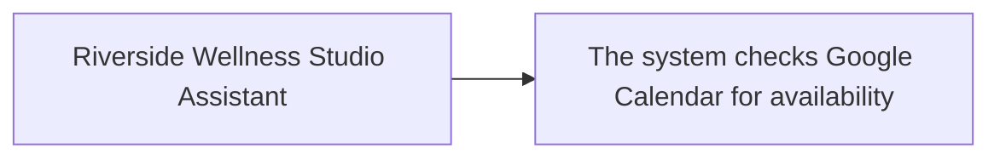

# AI Agent Architecture

> `implemented: true` on this capability means Stitchfy generated and validated vendor-neutral AI Agent architecture specifications based on the currently known business solution. It does not mean an LLM was executed, an AI agent was deployed, tools were invoked, outputs are accurate, or the agent is safe, compliant, or production-ready.

1 agent(s) generated.

## Riverside Wellness Studio Assistant

- Status: complete
- Interaction mode: conversational
- Autonomy: assistive
- Tools: 1
- Human oversight controls: 0

