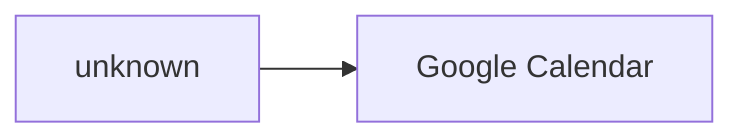

# Cloud Architecture

_Status: **needs-review** (cloud provider is unresolved; 2 unresolved information gap(s))_

> `implemented: true` on this capability means Stitchfy generated and validated a vendor-neutral cloud/deployment architecture for the currently known solution. It does not mean infrastructure was provisioned, an application was deployed, a cloud account or credentials exist, a region was selected (unless explicitly required), networking was configured, a database was created, scalability was tested, resilience was verified, or the architecture is production-ready.

## Hosting Model

- Model: **unknown**
- Provider: **unspecified** (not specified)

## Deployment Units

None identified.

## Runtime Requirements

- **RUNTIME-001** _(interactive)_ — Runtime for AI agent "Riverside Wellness Studio Assistant" — model/provider execution location is a separate, unresolved concern.

## State Requirements

- **STATE-001** _(durable)_ — Workflow "Appointment Booking Workflow" state must survive the wait between an approval being requested and resolved.
- **STATE-002** _(session)_ — Agent "Riverside Wellness Studio Assistant" requires session-scoped state.

## Persistence Requirements

None identified.

## Connectivity

- unknown (unknown) → external-system/SYS-001 (Google Calendar) _(unknown, exposure: external, protocol: https)_

## Environments

None explicitly required.

## Scalability

None explicitly required.

## Resilience

None explicitly required.

## Deployment Strategy

Not explicitly required.

## Security Mapping

- Security requirement `SECREQ-001` maps to deployment unit(s): none, connectivity: CONNECT-001
- Security requirement `SECREQ-002` maps to deployment unit(s): none, connectivity: CONNECT-001

## Observability Mapping

None identified.

## Information Gaps

- **Deployment boundary**: Should the identified runtime responsibilities deploy independently or share one application boundary?
- **Cloud provider**: Which provider, if any, is required for hosting this solution?

