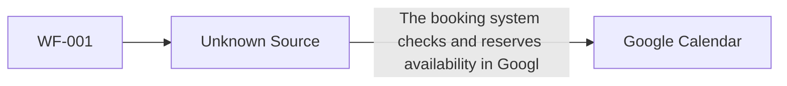

# Integration: The booking system checks and reserves availability in Google Calendar.

_Status: **needs-review** (source system unknown)_

> `implemented: true` on this capability means Stitchfy generated and validated this vendor-neutral integration specification — it does not mean Stitchfy connected to or exchanged data with the external system.

## Purpose

The booking system checks and reserves availability in Google Calendar.

## Source System

_Unknown — not stated by Discovery._

## Target System

Google Calendar (SYS-001)

## Related Workflow

- WF-001

## Operations

- **The system checks Google Calendar for availability** _(read)_ — The system checks Google Calendar for availability

## Interaction Pattern

- Direction: unknown
- Pattern: request-response
- Protocol: https

## Data Exchanged

None identified.

## Authentication

Mechanism: oauth2

## Reliability

- Retry required: unknown
- Idempotency required: unknown
- Timeout required: unknown
- Ordering required: unknown

## Error Handling

No explicit failure-handling policy discovered.

## Security Considerations

- Encryption in transit: true
- Contains sensitive data: true
- Secrets required: true
- Audit required: unknown

## Information Gaps

- **Integration source system**: What system will initiate: The booking system checks and reserves availability in Google Calendar.?
- **Integration failure handling**: What should happen if Google Calendar is unavailable during "The booking system checks and reserves availability in Google Calendar."?

## Traceability

Related processes: Appointment Booking (PROC-001)
Related requirements: none
Evidence: 1 reference(s)
