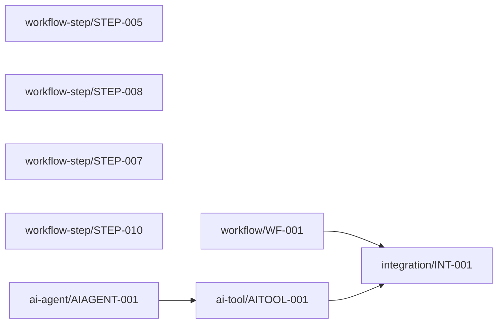

# Observability Architecture

_Status: **needs-review** (some telemetry requirements need more information (data classification/logging policy); some alert requirements have no known destination; no explicit operational objectives were stated; 2 unresolved information gap(s))_

> `implemented: true` on this capability means Stitchfy generated and validated a vendor-neutral observability and operational architecture for the currently known solution. It does not mean telemetry is being collected, logging exists, dashboards are deployed, alerts are active, tracing is installed, an SLO is being met, or production operations are ready.

## Scope

18 signal(s), 3 metric(s), 2 alert requirement(s), 0 operational objective(s) identified from the generated solution.

## Observable Components

- workflow/WF-001
- workflow-step/STEP-005
- workflow-step/STEP-008
- workflow-step/STEP-007
- workflow-step/STEP-010
- integration/INT-001
- ai-agent/AIAGENT-001
- ai-tool/AITOOL-001

## Workflow Visibility

- **Appointment Booking Workflow started** _(event, derived)_ — Workflow "Appointment Booking Workflow" started.
- **Appointment Booking Workflow completed** _(event, derived)_ — Workflow "Appointment Booking Workflow" completed.
- **Appointment Booking Workflow failed** _(event, derived)_ — Workflow "Appointment Booking Workflow" failed.
- **Decision evaluated: Every conflicting request is reviewed and approved by a front-desk employee before confirmation** _(event, derived)_ — Decision "Every conflicting request is reviewed and approved by a front-desk employee before confirmation" was evaluated.
- **Decision evaluated: Conflicting appointment requests must always be routed to a front-desk employee for approval before confirmation.** _(event, derived)_ — Decision "Conflicting appointment requests must always be routed to a front-desk employee for approval before confirmation." was evaluated.
- **Approval requested: Every conflicting request is reviewed and approved by a front-desk employee before confirmation** _(event, derived)_ — Human approval ("Every conflicting request is reviewed and approved by a front-desk employee before confirmation") was requested.
- **Approval completed: Every conflicting request is reviewed and approved by a front-desk employee before confirmation** _(event, derived)_ — Human approval ("Every conflicting request is reviewed and approved by a front-desk employee before confirmation") was resolved.
- **Approval requested: Conflicting appointment requests must always be routed to a front-desk employee for approval before confirmation.** _(event, derived)_ — Human approval ("Conflicting appointment requests must always be routed to a front-desk employee for approval before confirmation.") was requested.
- **Approval completed: Conflicting appointment requests must always be routed to a front-desk employee for approval before confirmation.** _(event, derived)_ — Human approval ("Conflicting appointment requests must always be routed to a front-desk employee for approval before confirmation.") was resolved.
- **Notification attempted: Confirmed appointments are recorded and a reminder is sent before the appointment** _(event, derived)_ — Notification ("Confirmed appointments are recorded and a reminder is sent before the appointment") delivery was attempted.

## Integration Visibility

- **The system checks Google Calendar for availability attempted** _(event, derived)_ — Integration operation "The system checks Google Calendar for availability" (The booking system checks and reserves availability in Google Calendar.) attempted.
- **The system checks Google Calendar for availability succeeded** _(event, derived)_ — Integration operation "The system checks Google Calendar for availability" (The booking system checks and reserves availability in Google Calendar.) succeeded.
- **The system checks Google Calendar for availability failed** _(event, derived)_ — Integration operation "The system checks Google Calendar for availability" (The booking system checks and reserves availability in Google Calendar.) failed.

## AI Agent Visibility

- **Riverside Wellness Studio Assistant interaction started** _(event, derived)_ — Agent "Riverside Wellness Studio Assistant" interaction started.
- **Riverside Wellness Studio Assistant interaction completed** _(event, derived)_ — Agent "Riverside Wellness Studio Assistant" interaction completed.
- **Tool invocation: The system checks Google Calendar for availability requested** _(event, derived)_ — Tool "The system checks Google Calendar for availability" invocation by agent "Riverside Wellness Studio Assistant" requested.
- **Tool invocation: The system checks Google Calendar for availability completed** _(event, derived)_ — Tool "The system checks Google Calendar for availability" invocation by agent "Riverside Wellness Studio Assistant" completed.
- **Tool invocation: The system checks Google Calendar for availability failed** _(event, derived)_ — Tool "The system checks Google Calendar for availability" invocation by agent "Riverside Wellness Studio Assistant" failed.

## Logs and Events

- **integration operation outcome** _(level: unknown)_ — prohibited: credential/API-key material

## Metrics

- **The booking system checks and reserves availability in Google Calendar. operation count** _(counter)_ — Count of operation attempts for "The booking system checks and reserves availability in Google Calendar.".
- **The booking system checks and reserves availability in Google Calendar. failure count** _(counter)_ — Count of operation failures for "The booking system checks and reserves availability in Google Calendar.".
- **The booking system checks and reserves availability in Google Calendar. operation duration** _(timer)_ — Duration of operation attempts for "The booking system checks and reserves availability in Google Calendar.". No target/threshold implied.

## Correlation / Tracing

- Operations for "The booking system checks and reserves availability in Google Calendar." should be correlatable back to the workflow that triggered them. (path: workflow/WF-001 → integration/INT-001)
- Tool "The system checks Google Calendar for availability" invocations by agent "Riverside Wellness Studio Assistant" should be correlatable to the underlying integration operation. (path: ai-agent/AIAGENT-001 → ai-tool/AITOOL-001 → integration/INT-001)

## Auditability

- Audit requirement `AUDIT-001` is satisfied by signal(s): SIGNAL-001, SIGNAL-002, SIGNAL-003, SIGNAL-010
- Audit requirement `AUDIT-002` is satisfied by signal(s): SIGNAL-001, SIGNAL-002, SIGNAL-003, SIGNAL-010

## Health Requirements

- **workflow/WF-001** _(business-process)_ — Ability to determine whether workflow "Appointment Booking Workflow" is completing successfully.
- **integration/INT-001** _(dependency)_ — Ability to determine whether "The booking system checks and reserves availability in Google Calendar." is operational.

## Alert Requirements

- **Operations must be notified if automated confirmation or reminder delivery fails.** _(warning, explicit)_ — Operations must be notified if automated confirmation or reminder delivery fails.; threshold: unresolved; destination: unresolved
- **Appointment Booking Workflow approval pending review** _(warning, derived)_ — Workflow "Appointment Booking Workflow" has a pending human approval requiring review.; threshold: unresolved; destination: unresolved

## Operational Objectives

None stated.

## Dashboards / Operational Views

- **Workflow Operations View** — Operational visibility into generated workflow execution outcomes, decisions, and approvals. (10 signal(s))
- **Integration Health View** — Operational visibility into external integration operation outcomes. (3 signal(s))
- **AI Agent Operations View** — Operational visibility into AI agent interactions, tool invocations, and escalations. (5 signal(s))

## Data Protection in Telemetry

- Telemetry must avoid recording the associated business payload until data classification (currently "confidential") and logging policy are resolved.
- Prohibited from telemetry for integration/INT-001: credential/API-key material

## Information Gaps

- **Alert destination**: Who or what system should receive the alert for "Operations must be notified if automated confirmation or reminder delivery fails."?
- **Alert destination**: Who should be notified when workflow "Appointment Booking Workflow" has a pending approval (Approval requested: Every conflicting request is reviewed and approved by a front-desk employee before confirmation)?

## Traceability

Signals: 18, Metrics: 3, Evidence references: 22

