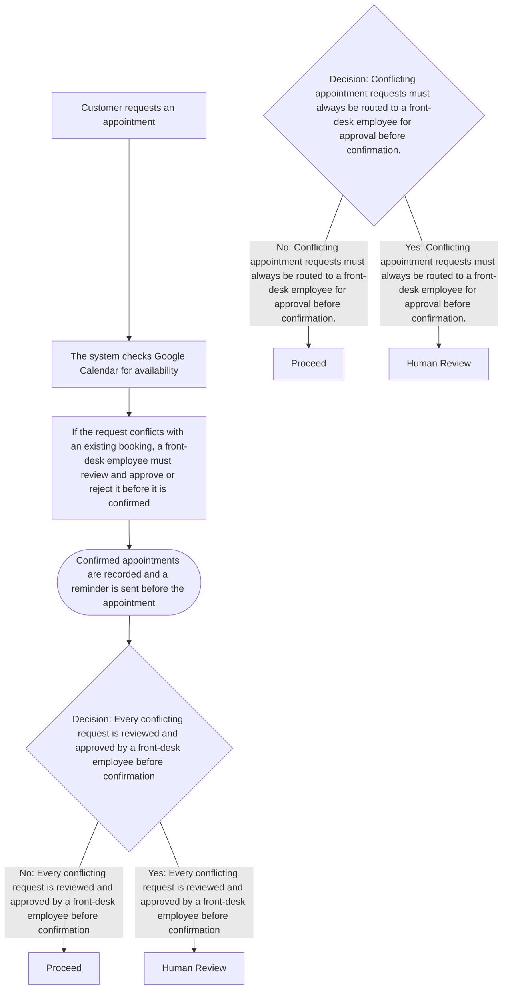

# Appointment Booking Workflow

_Status: **needs-review** (notification channel unknown)_

> `implemented: true` on this capability means Stitchfy generated and validated this vendor-neutral specification — it does not mean this workflow has been deployed or is running against real systems.

## Source Process

Appointment Booking (PROC-001)

## Trigger

- **business-event:** Customer requests an appointment by phone, WhatsApp, or the AI assistant

## Current Process (AS-IS)

Trigger: Customer requests an appointment by phone, WhatsApp, or the AI assistant

Steps:
1. Customer requests an appointment
2. The system checks Google Calendar for availability
3. If the request conflicts with an existing booking, a front-desk employee must review and approve or reject it before it is confirmed
4. Confirmed appointments are recorded and a reminder is sent before the appointment

Discovered automation candidates: Online appointment requests; Calendar synchronization; Automated confirmations and reminders; An AI assistant that answers routine questions and checks availability

## Proposed Workflow (TO-BE)

1. **Customer requests an appointment** _(automated-task)_ — Customer requests an appointment
2. **The system checks Google Calendar for availability** _(automated-task)_ — The system checks Google Calendar for availability
3. **If the request conflicts with an existing booking, a front-desk employee must review and approve or reject it before it is confirmed** _(human-task)_ — If the request conflicts with an existing booking, a front-desk employee must review and approve or reject it before it is confirmed
4. **Confirmed appointments are recorded and a reminder is sent before the appointment** _(notification)_ — Confirmed appointments are recorded and a reminder is sent before the appointment
5. **Decision: Every conflicting request is reviewed and approved by a front-desk employee before confirmation** _(decision)_ — Every conflicting request is reviewed and approved by a front-desk employee before confirmation
6. **Proceed** _(automated-task)_ — Continue without human review.
7. **Human Review** _(human-task)_ — Desired outcome "Every conflicting request is reviewed and approved by a front-desk employee before confirmation" explicitly requires human oversight — preserved rather than automated away.
8. **Decision: Conflicting appointment requests must always be routed to a front-desk employee for approval before confirmation.** _(decision)_ — Conflicting appointment requests must always be routed to a front-desk employee for approval before confirmation.
9. **Proceed** _(automated-task)_ — Continue without human review.
10. **Human Review** _(human-task)_ — Requirement "Conflicting appointment requests must always be routed to a front-desk employee for approval before confirmation." explicitly requires human oversight — preserved rather than automated away.

## Human Tasks

- If the request conflicts with an existing booking, a front-desk employee must review and approve or reject it before it is confirmed — Front-desk employee (ACTOR-004)
- Human Review
- Human Review

## Automated Tasks

- Customer requests an appointment _(automated-task)_
- The system checks Google Calendar for availability _(automated-task)_
- Proceed _(automated-task)_
- Proceed _(automated-task)_

## Decisions

- **Every conflicting request is reviewed and approved by a front-desk employee before confirmation**
  - No → Proceed (STEP-006)
  - Yes → Human Review (STEP-007)
- **Conflicting appointment requests must always be routed to a front-desk employee for approval before confirmation.**
  - No → Proceed (STEP-009)
  - Yes → Human Review (STEP-010)

## Approvals

- Approver: Front-desk employee — Every conflicting request is reviewed and approved by a front-desk employee before confirmation
- Approver: Front-desk employee — Conflicting appointment requests must always be routed to a front-desk employee for approval before confirmation.

## Notifications

- Confirmed appointments are recorded and a reminder is sent before the appointment — channel: unknown

## External Systems

- Google Calendar (SYS-001) — saas system (integration)
- WhatsApp (SYS-002) — saas system

## Information Gaps

- **Notification channel**: What channel should be used for: "Confirmed appointments are recorded and a reminder is sent before the appointment"?

## Traceability

Source process: Appointment Booking (PROC-001)
Steps: 10, Transitions: 8, Decisions: 2, Approvals: 2
