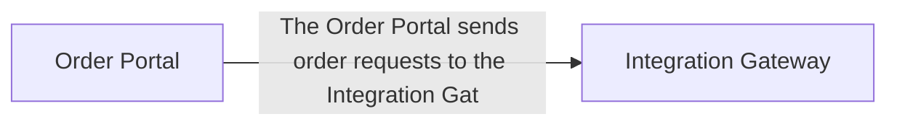

# Integration: The Order Portal sends order requests to the Integration Gateway.

_Status: **needs-review** (authentication mechanism unknown)_

> `implemented: true` on this capability means Stitchfy generated and validated this vendor-neutral integration specification — it does not mean Stitchfy connected to or exchanged data with the external system.

## Purpose

The Order Portal sends order requests to the Integration Gateway.

## Source System

Order Portal (SYS-001)

## Target System

Integration Gateway (SYS-002)

## Related Workflow

None.

## Operations

None identified.

## Interaction Pattern

- Direction: unknown
- Pattern: request-response
- Protocol: https

## Data Exchanged

None identified.

## Authentication

Mechanism: unknown

## Reliability

- Retry required: unknown
- Idempotency required: unknown
- Timeout required: unknown
- Ordering required: true

## Error Handling

No explicit failure-handling policy discovered.

## Security Considerations

- Encryption in transit: true
- Contains sensitive data: unknown
- Secrets required: unknown
- Audit required: unknown

## Information Gaps

- **Integration authentication**: What authentication mechanism is required for "The Order Portal sends order requests to the Integration Gateway."?
- **Integration failure handling**: What should happen if Integration Gateway is unavailable during "The Order Portal sends order requests to the Integration Gateway."?

## Traceability

Related processes: none
Related requirements: none
Evidence: 1 reference(s)
