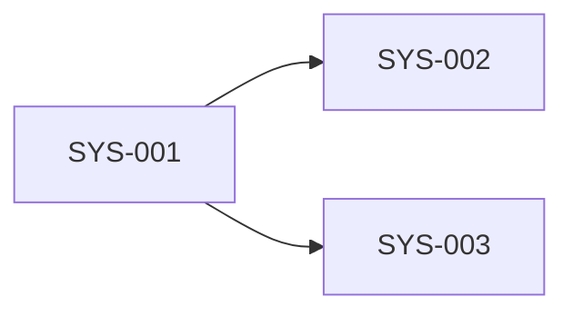

# System Dependency Map

> `implemented: true` on this capability means Stitchfy generated and validated a legacy-modernization assessment and migration-strategy architecture from currently known evidence. It does not mean application code was analyzed, code was migrated, dependencies were upgraded, databases were converted, tests passed, production behavior was preserved, a target system was deployed, or migration risk was eliminated.

## Systems

- `SYS-001`

## Dependencies

- `SYS-001` → `SYS-002` _(api, unknown)_
- `SYS-001` → `SYS-003` _(database, unknown)_

## External Boundaries

- `SYS-002` _(external to modernization scope)_
- `SYS-003` _(external to modernization scope)_

## Integration Contracts

- `INT-001` — The Order Portal sends order requests to the Integration Gateway.
- `INT-002` — The Order Portal reads and writes order records in the Order Database.

## Data Dependencies

- `SYS-001` → `SYS-003`

## Unknown Dependencies

- `SYS-001` → `SYS-002`
- `SYS-001` → `SYS-003`

## Mermaid Diagram

