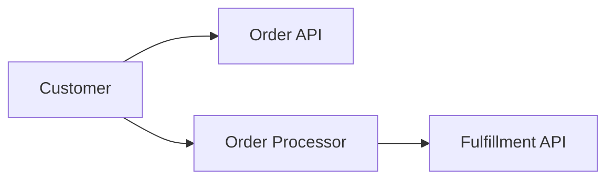

# Cloud Architecture

_Status: **needs-review** (cloud provider is unresolved; persistence technology is unresolved; deployment strategy is unresolved; 3 unresolved information gap(s))_

> `implemented: true` on this capability means Stitchfy generated and validated a vendor-neutral cloud/deployment architecture for the currently known solution. It does not mean infrastructure was provisioned, an application was deployed, a cloud account or credentials exist, a region was selected (unless explicitly required), networking was configured, a database was created, scalability was tested, resilience was verified, or the architecture is production-ready.

## Hosting Model

- Model: **unknown**
- Provider: **unspecified** (not specified)

## Deployment Units

- **Order API** _(api, solution-managed, workload: request-driven)_
- **Order Processor** _(worker, solution-managed, workload: background)_

## Runtime Requirements

- **RUNTIME-001** _(request-driven)_ — Runtime for solution-managed component "Order API".
- **RUNTIME-002** _(background)_ — Runtime for solution-managed component "Order Processor".

## State Requirements

- **STATE-001** _(durable)_ — Order processing state must persist and survive application restarts.

## Persistence Requirements

- **PERSIST-001** _(durable, technology: unspecified)_ — Order processing state must persist and survive application restarts.

## Connectivity

- deployment-unit/DEPLOYUNIT-002 (Order Processor) → external-system/SYS-001 (Fulfillment API) _(outbound, exposure: external, protocol: https)_
- actor (Customer) → deployment-unit/DEPLOYUNIT-001 (Order API) _(inbound, exposure: public, protocol: https)_
- actor (Customer) → deployment-unit/DEPLOYUNIT-002 (Order Processor) _(inbound, exposure: internal, protocol: unknown)_

## Environments

- **Test** _(test, isolated: true)_
- **Production** _(production, isolated: true)_

## Scalability

- **concurrency**: 100 concurrent order submissions

## Resilience

- **dependency-failure** _(strategy: unspecified)_ — The solution must continue accepting new orders when the external Fulfillment API is temporarily unavailable.

## Deployment Strategy

Not explicitly required.

## Security Mapping

- Security requirement `SECREQ-001` maps to deployment unit(s): DEPLOYUNIT-002, connectivity: CONNECT-001
- Security requirement `SECREQ-002` maps to deployment unit(s): DEPLOYUNIT-002, connectivity: CONNECT-001

## Observability Mapping

None identified.

## Information Gaps

- **Cloud provider**: Which provider, if any, is required for hosting this solution?
- **Persistence technology**: What persistence technology should satisfy the identified durable-state requirements?
- **Deployment strategy**: What deployment strategy is required for solution-managed components?

