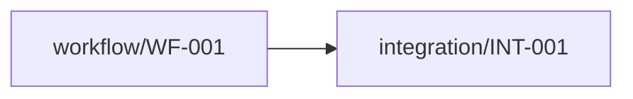

# Observability Architecture

_Status: **needs-review** (some telemetry requirements need more information (data classification/logging policy); some alert requirements have no known destination; 1 unresolved information gap(s))_

> `implemented: true` on this capability means Stitchfy generated and validated a vendor-neutral observability and operational architecture for the currently known solution. It does not mean telemetry is being collected, logging exists, dashboards are deployed, alerts are active, tracing is installed, an SLO is being met, or production operations are ready.

## Scope

6 signal(s), 3 metric(s), 1 alert requirement(s), 1 operational objective(s) identified from the generated solution.

## Observable Components

- workflow/WF-001
- integration/INT-001

## Workflow Visibility

- **Order Submission Workflow started** _(event, derived)_ — Workflow "Order Submission Workflow" started.
- **Order Submission Workflow completed** _(event, derived)_ — Workflow "Order Submission Workflow" completed.
- **Order Submission Workflow failed** _(event, derived)_ — Workflow "Order Submission Workflow" failed.

## Integration Visibility

- **The Order Processor validates the order and forwards it to the Fulfillment API attempted** _(event, derived)_ — Integration operation "The Order Processor validates the order and forwards it to the Fulfillment API" (The Order Processor submits orders to the Fulfillment API.) attempted.
- **The Order Processor validates the order and forwards it to the Fulfillment API succeeded** _(event, derived)_ — Integration operation "The Order Processor validates the order and forwards it to the Fulfillment API" (The Order Processor submits orders to the Fulfillment API.) succeeded.
- **The Order Processor validates the order and forwards it to the Fulfillment API failed** _(event, derived)_ — Integration operation "The Order Processor validates the order and forwards it to the Fulfillment API" (The Order Processor submits orders to the Fulfillment API.) failed.

## AI Agent Visibility

None identified.

## Logs and Events

- **integration operation outcome** _(level: unknown)_ — prohibited: credential/API-key material

## Metrics

- **The Order Processor submits orders to the Fulfillment API. operation count** _(counter)_ — Count of operation attempts for "The Order Processor submits orders to the Fulfillment API.".
- **The Order Processor submits orders to the Fulfillment API. failure count** _(counter)_ — Count of operation failures for "The Order Processor submits orders to the Fulfillment API.".
- **The Order Processor submits orders to the Fulfillment API. operation duration** _(timer)_ — Duration of operation attempts for "The Order Processor submits orders to the Fulfillment API.". No target/threshold implied.

## Correlation / Tracing

- Operations for "The Order Processor submits orders to the Fulfillment API." should be correlatable back to the workflow that triggered them. (path: workflow/WF-001 → integration/INT-001)

## Auditability

None identified.

## Health Requirements

- **workflow/WF-001** _(business-process)_ — Ability to determine whether workflow "Order Submission Workflow" is completing successfully.
- **integration/INT-001** _(dependency)_ — Ability to determine whether "The Order Processor submits orders to the Fulfillment API." is operational.

## Alert Requirements

- **Operations must be notified after 5 consecutive failed fulfillment submissions.** _(warning, explicit)_ — Operations must be notified after 5 consecutive failed fulfillment submissions.; threshold: 5 consecutive; destination: unresolved

## Operational Objectives

- **95% of accepted order submissions should complete within 2 seconds.** _(latency, explicit)_ — target: 95% within 2 seconds

## Dashboards / Operational Views

- **Workflow Operations View** — Operational visibility into generated workflow execution outcomes, decisions, and approvals. (3 signal(s))
- **Integration Health View** — Operational visibility into external integration operation outcomes. (3 signal(s))

## Data Protection in Telemetry

- Telemetry must avoid recording the associated business payload until data classification (currently "unknown") and logging policy are resolved.
- Telemetry must avoid recording the associated business payload until data classification (currently "unknown") and logging policy are resolved.
- Prohibited from telemetry for integration/INT-001: credential/API-key material

## Information Gaps

- **Alert destination**: Who or what system should receive the alert for "Operations must be notified after 5 consecutive failed fulfillment submissions."?

## Traceability

Signals: 6, Metrics: 3, Evidence references: 8

