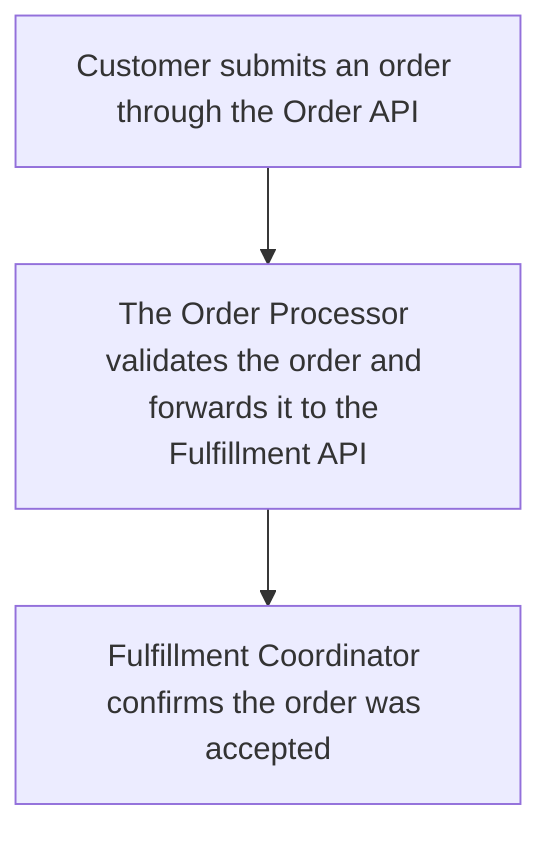

# Order Submission Workflow

_Status: **complete**_

> `implemented: true` on this capability means Stitchfy generated and validated this vendor-neutral specification — it does not mean this workflow has been deployed or is running against real systems.

## Source Process

Order Submission (PROC-001)

## Trigger

- **business-event:** A customer submits an order through the Order API

## Current Process (AS-IS)

Trigger: A customer submits an order through the Order API

Steps:
1. Customer submits an order through the Order API
2. The Order Processor validates the order and forwards it to the Fulfillment API
3. Fulfillment Coordinator confirms the order was accepted

## Proposed Workflow (TO-BE)

1. **Customer submits an order through the Order API** _(human-task)_ — Customer submits an order through the Order API
2. **The Order Processor validates the order and forwards it to the Fulfillment API** _(external-task)_ — The Order Processor validates the order and forwards it to the Fulfillment API
3. **Fulfillment Coordinator confirms the order was accepted** _(human-task)_ — Fulfillment Coordinator confirms the order was accepted

## Human Tasks

- Customer submits an order through the Order API — Customer (ACTOR-003)
- Fulfillment Coordinator confirms the order was accepted — Fulfillment Coordinator (ACTOR-002)

## Automated Tasks

- The Order Processor validates the order and forwards it to the Fulfillment API _(external-task)_

## Decisions

None — no explicit conditional logic was discovered.

## Approvals

None.

## Notifications

None.

## External Systems

- Fulfillment API (SYS-001) — api system (integration)

## Information Gaps

None.

## Traceability

Source process: Order Submission (PROC-001)
Steps: 3, Transitions: 2, Decisions: 0, Approvals: 0
